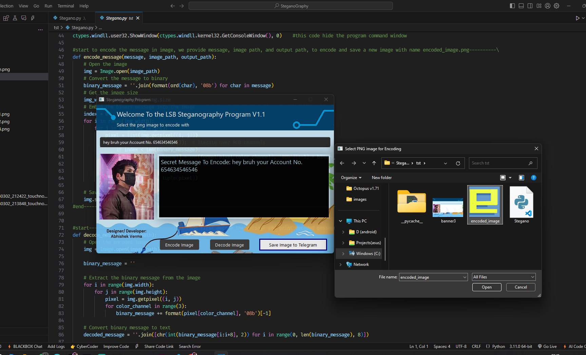

# Project-Steganography:-

	Steganography is a technique use for hiding or encoding a secret information in an image or music, file.

Steganography Tool:-

A simple and user-friendly Steganography application built with Python and PySide6. This program allows users to hide secret 	messages within image files (encoding) and retrieve hidden messages from encoded images (decoding).

Features:-

	Message Encoding: Hide text messages securely within image files.
	Message Decoding: Extract hidden messages from encoded image files.
	Intuitive Graphical User Interface (GUI) for ease of use.
	Supports common image formats (eg. .png, .jpg) but PNG is more preferred.

Technologies Used:-

	Python 3.x
	PySide6 for GUI
	Pillow for image processing

Usage:-
	To Run the application:
	python stegano.py

Use the GUI to:-

	Encode: Select an image file, input your secret message, and save the encoded image.
	Decode: Select an encoded image to reveal the hidden message

Contribution:-

	Feel free to fork the project, submit issues, or create pull requests to contribute.

License:-

	This project is licensed under the MIT License. See the LICENSE file for more details.
